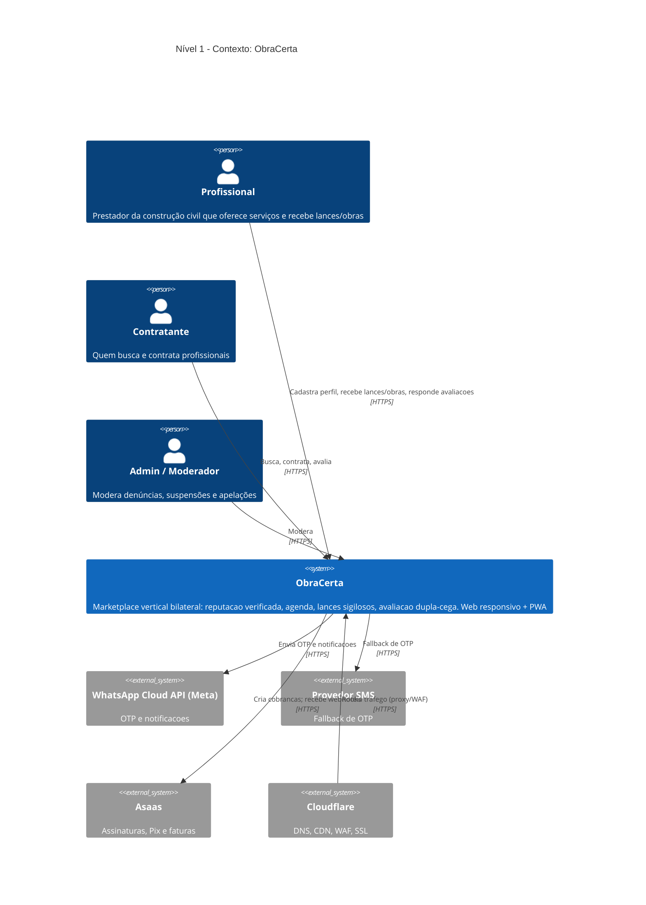
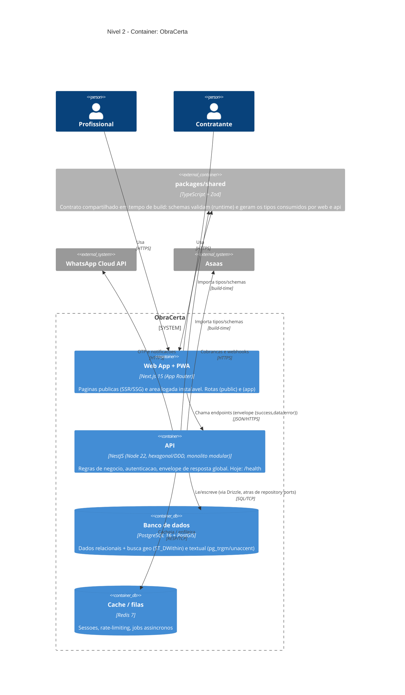

# Diagrama C4 — ObraCerta / QuemFaz (inicial)

> Artefato da Fase 0 (`docs/PLANO_DE_IMPLEMENTACAO.md` §8). Níveis 1 (Contexto) e 2
> (Container). Níveis 3 (Componente) e 4 (Código) entram quando os domínios forem
> implementados (Fase 1+).

## O que é o "C4"

C4 é uma forma de desenhar arquitetura de software em **4 níveis de zoom**, do mais
amplo ao mais detalhado — como um mapa que você vai aproximando:

1. **Contexto (System Context):** o sistema como uma "caixa preta" e quem/o que
   fala com ele (pessoas e sistemas externos). Responde: *"o que é isso e com quem
   conversa?"*
2. **Container:** abre a caixa e mostra as **unidades executáveis/armazenáveis**
   (app web, API, banco, cache). "Container" aqui **não é Docker** — é "coisa que
   roda ou guarda dado". Responde: *"de quais peças de alto nível isso é feito?"*
3. **Componente:** abre um container e mostra os blocos internos (módulos/serviços).
4. **Código:** classes/funções (raramente desenhado à mão; o código é a fonte).

**Por que usar:** comunica a arquitetura pra qualquer pessoa sem afogar em detalhe.
Cada nível tem o público certo (Contexto → negócio; Container → time técnico).

---

## Nível 1 — Contexto

Quem usa o ObraCerta e de quais serviços externos ele depende.

> Observação de privacidade (LGPD, plan §9): dados sensíveis como CPF nunca trafegam
> nas respostas públicas — ver `userSchema` em `packages/shared`.

---

## Nível 2 — Container

Abrindo a caixa "ObraCerta": as peças que rodam/guardam dado e como conversam.
Reflete o estado **da Fase 0** (a regra de negócio mora dentro da API a partir da Fase 1).

### Notas de leitura

- **`packages/shared` não é um processo que roda** — é uma biblioteca compartilhada
  consumida em **tempo de build** por web e API. Desenhei como `Container_Ext`
  tracejado só para deixar visível a decisão "load-bearing" do type-safety end-to-end.
- **"Container" ≠ Docker.** O Postgres e o Redis *também* rodam em Docker localmente,
  mas aqui eles aparecem por serem unidades de dados da arquitetura, não por causa do
  Docker.
- **Drizzle atrás de ports:** a API não acopla a regra de negócio ao banco — fala com
  repositórios (interfaces). Trocar o ORM fica contido à infraestrutura (ver ADR-0001).
- **Deploy (futuro):** em produção, Cloudflare → Coolify (VPS São Paulo) servindo os
  containers `web` e `api`; Postgres e Redis gerenciados no mesmo host. Adiado: a
  Fase 0 é validada em localhost.

---

## Referências

- `docs/ADRs/0001-stack.md` — decisões de stack (inclui escolha do Drizzle).
- `docs/PLANO_DE_IMPLEMENTACAO.md` — §4 (modelo de dados), §8 (roadmap).
- `apps/api/README.md` — convenção de camadas hexagonais.
